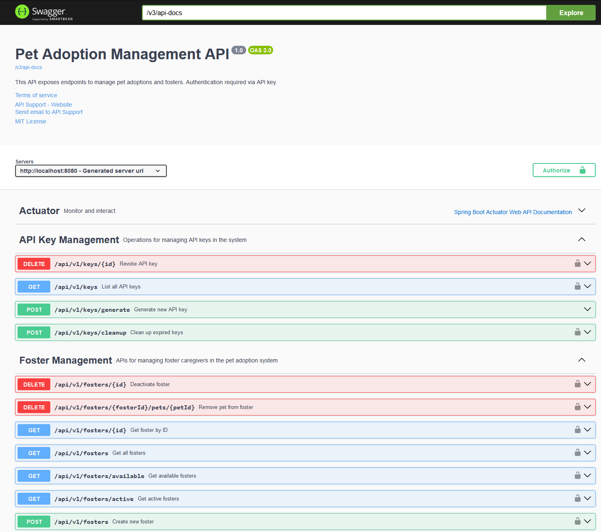
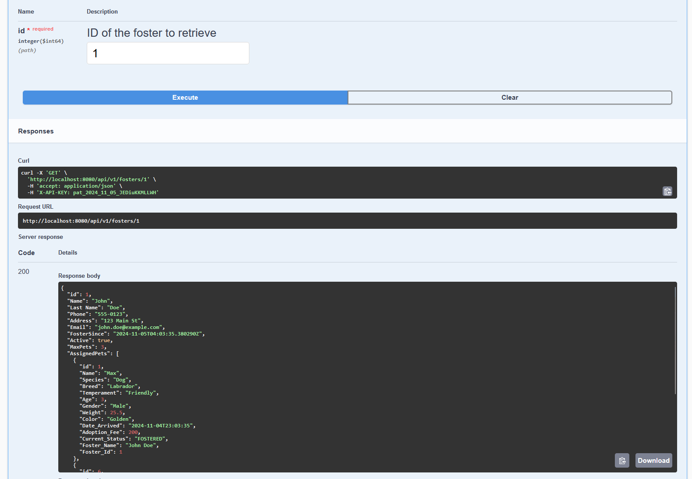
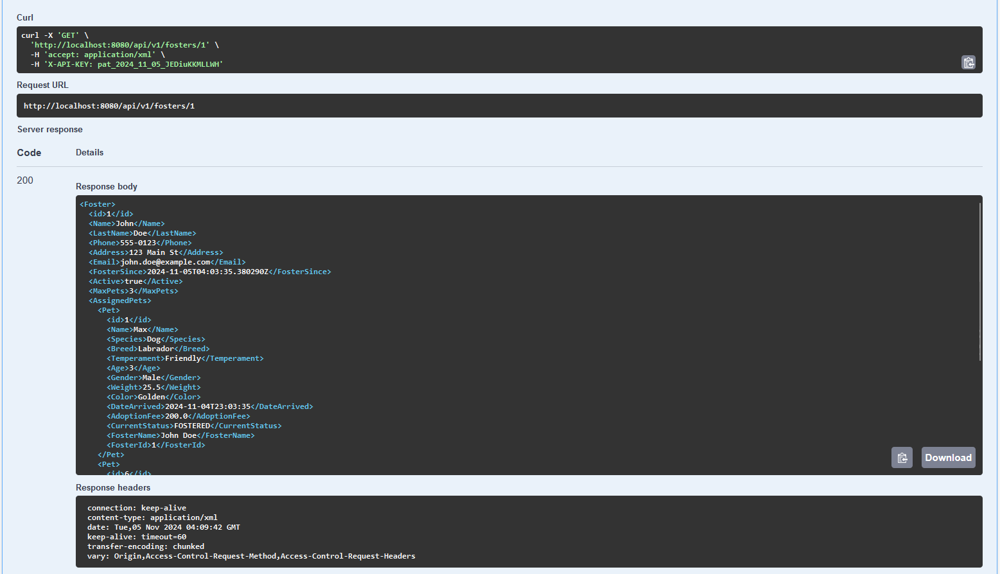
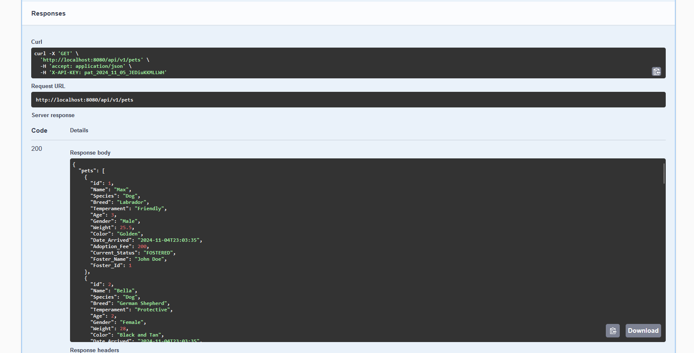
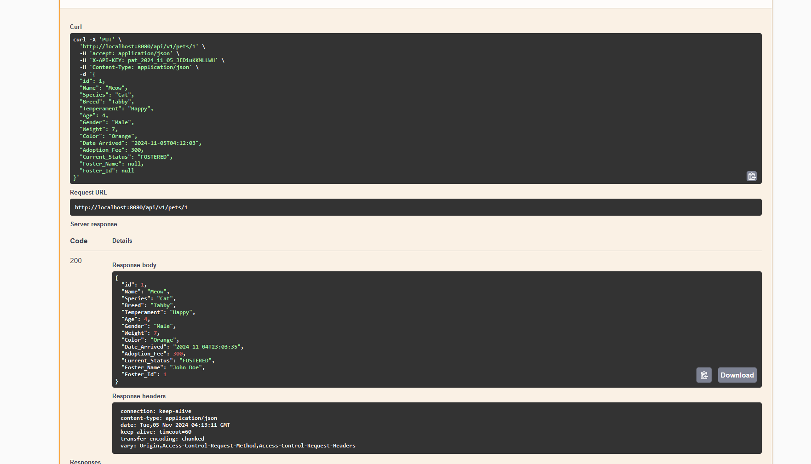

# Pet Adoption REST API

## Table of Contents
1. [Overview](#overview)
2. [System Architecture](#system-architecture)
3. [API Security](#api-security)
4. [API Endpoints](#api-endpoints)
5. [Data Models](#data-models)
6. [Business Processes](#business-processes)
7. [Features](#features)
8. [Dependencies](#dependencies)
9. [Development Setup](#development-setup)
10. [Deployment](#deployment)

## Overview
The Pet Adoption REST API is a comprehensive Spring Boot application designed to manage pet adoptions and foster care assignments. It provides secure endpoints for managing pets, fosters, and API keys, supporting both JSON and XML responses with full OpenAPI documentation.

### Key Features
- Complete pet lifecycle management (CRUD operations)
- Foster care coordination system
- API key authentication with expiration management
- OpenAPI/Swagger documentation
- Support for both JSON and XML responses
- Docker containerization
- In-memory H2 database with web console
- Web-based management interface

## System Architecture
The system follows a layered Spring Boot architecture with comprehensive separation of concerns:

### Core Components
- **Controllers**: Handle HTTP requests and content negotiation
    - `PetController`: Pet management with JSON/XML support
    - `FosterController`: Foster management with JSON/XML support
    - `ApiKeyController`: API key lifecycle management
- **Services**: Business logic layer
    - `PetService`: Pet-related business operations
    - `FosterService`: Foster-related business operations
    - `ApiKeyService`: API key generation and validation
- **Repositories**: Data access layer
    - `PetRepository`: Pet data operations
    - `FosterRepository`: Foster data operations
    - `ApiKeyRepository`: API key storage
- **Models**: Domain entities with validation
    - `Pet`: Pet entity with status tracking
    - `Foster`: Foster entity with capacity management
    - `ApiKey`: API key entity with expiration handling

### Technologies Used
- Spring Boot 3.3.5
- Spring Data JPA
- H2 Database
- OpenAPI 3.0
- Jackson (JSON/XML processing)
- Docker & Docker Compose
- Java 21
- Lombok
- Maven

## API Security
The API implements a robust security system using API keys:

- All endpoints (except `/api/v1/keys/generate`) require API key authentication
- API keys are transmitted via the `X-API-KEY` header
- Keys can be configured with expiration dates
- Support for key revocation and automatic cleanup
- Multiple key types support (UUID, versioned, prefixed)
- Key validation includes active status and expiration checks

## API Endpoints

### Pet Management
```
GET    /api/v1/pets                   - Get all pets
GET    /api/v1/pets/{id}             - Get pet by ID
GET    /api/v1/pets/available        - Get available pets
GET    /api/v1/pets/species/{species} - Get pets by species
GET    /api/v1/pets/needs-foster     - Get pets needing foster care
POST   /api/v1/pets                   - Create new pet
PUT    /api/v1/pets/{id}             - Update pet
PUT    /api/v1/pets/{id}/status      - Update pet status
DELETE /api/v1/pets/{id}             - Remove pet
```

### Foster Management
```
GET    /api/v1/fosters                          - Get all fosters
GET    /api/v1/fosters/{id}                     - Get foster by ID
GET    /api/v1/fosters/active                   - Get active fosters
GET    /api/v1/fosters/available                - Get available fosters
POST   /api/v1/fosters                          - Create new foster
PUT    /api/v1/fosters/{id}                     - Update foster
DELETE /api/v1/fosters/{id}                     - Deactivate foster
POST   /api/v1/fosters/{fosterId}/pets/{petId}  - Assign pet to foster
DELETE /api/v1/fosters/{fosterId}/pets/{petId}  - Remove pet from foster
```

### API Key Management
```
POST   /api/v1/keys/generate  - Generate new API key
GET    /api/v1/keys          - List all API keys
DELETE /api/v1/keys/{id}     - Revoke API key
POST   /api/v1/keys/cleanup  - Clean up expired keys
```

## Data Models

### Pet
```java
public class Pet {
    private Long id;
    private String name;
    private String species;
    private String breed;
    private String temperament;
    private int age;
    private String gender;
    private double weight;
    private String color;
    private LocalDateTime dateArrived;
    private double adoptionFee;
    private Foster currentFoster;
    private Status currentStatus; // FOSTERED, AVAILABLE, ADOPTED, REMOVED
}
```

### Foster
```java
public class Foster extends User {
    private Instant fosterSince;
    private boolean active;
    private int maxPets;
    private List<Pet> petsAssigned;
}
```

### ApiKey
```java
public class ApiKey {
    private Long id;
    private String keyValue;
    private String description;
    private boolean active;
    private Instant createdAt;
    private Instant expiresAt;
    private String createdBy;
}
```

## Business Processes

1. Pet Management
    - Complete pet registration with detailed information
    - Status tracking (Available, Fostered, Adopted, Removed)
    - Foster assignment management
    - Adoption fee tracking
    - Species-based categorization
    - Automatic status updates based on foster assignments

2. Foster Management
    - Foster registration with validation
    - Pet capacity management (configurable limits)
    - Active/Inactive status tracking
    - Pet assignment tracking
    - Availability checking
    - Automatic pet reassignment on deactivation

3. API Key Management
    - Multiple key generation strategies
    - Configurable expiration periods
    - Key validation and revocation
    - Automatic cleanup of expired keys
    - Key usage tracking
    - Secure key storage

## Features

### Data Format Support
- JSON responses for modern API clients
- XML responses for legacy system integration
- Content negotiation based on Accept header
- Consistent error response format across formats

### Documentation
- Interactive Swagger UI documentation
- OpenAPI 3.0 specification
- Detailed endpoint descriptions
- Example requests and responses
- Authentication documentation

### Web Interface
- Modern Bootstrap-based UI
- Real-time API interaction
- API key management interface
- Pet and foster management dashboards
- Status monitoring and updates

### Database Management
- H2 in-memory database
- Web-based H2 console
- JPA entity management
- Automated schema generation
- Data initialization for testing

## Development Setup

1. Prerequisites:
   ```bash
   - Java 21
   - Maven 3.8+
   - Docker (optional)
   ```

2. Clone the repository:
   ```bash
   git clone <repository-url>
   cd pet-adoption-api
   ```

3. Build the application:
   ```bash
   ./mvnw clean package
   ```

4. Run locally:
   ```bash
   ./mvnw spring-boot:run
   ```

## Deployment

### Docker Deployment
The application includes a production-ready Docker configuration:

1. Build the Docker image:
```bash
docker compose build
```

2. Run the container:
```bash
docker compose up -d
```

### Access Points
- API Documentation: http://localhost:8080/swagger-ui.html
- H2 Console: http://localhost:8080/h2-console
- Web Interface: http://localhost:8080/index.html

### Environment Configuration
Key configuration in application.properties:
```properties
server.port=8080
spring.datasource.url=jdbc:h2:mem:petdb
spring.jpa.hibernate.ddl-auto=update
spring.h2.console.enabled=true
spring.jackson.default-property-inclusion=non_null
```

### Docker Configuration
The application uses a multi-stage build process:
- Build stage: eclipse-temurin:21-jdk-alpine
- Runtime stage: eclipse-temurin:21-jre-alpine
- Health checks and resource limits
- Non-root user for security
- Volume mapping for persistence
- Network isolation

### Security Considerations
- API key authentication required for all endpoints
- CORS configuration for web client access
- Secure H2 console configuration
- Non-root Docker user
- Resource limits and health checks
- Error message sanitization

### Screenshots

#### Main Console


#### Open API Interface


#### Generating a key


#### Getting foster by ID JSON response


#### Getting foster by ID XML response


#### Deactivating a foster
 

#### Listing all pets


#### Updating pet id = 1

